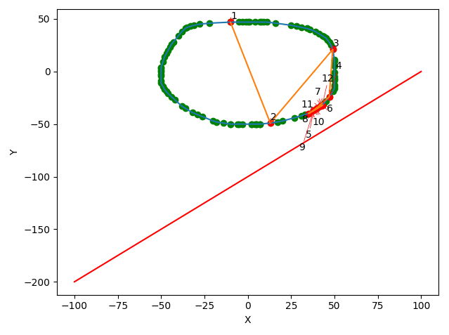
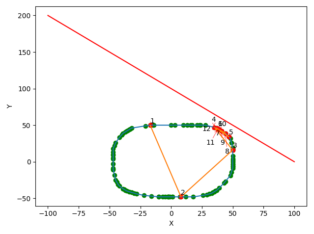

# Path Finder
Algorithm to determine the minimum distance between a vertex of a convex polygon with integer coordinates 
and a line of the form ax + by = c. 
### 


### Assumptions
- We assume that the polygon and the line are non-intersecting. We based this off of the fact that the "sunny side" is 
referenced in the assignment instructions which would not make sense if an intersection were to exist. 
- Input is given in YAML format with keys `polygon` as a list of points representing the vertices of the polygon in 
clockwise order and `line` a three tuple `(a,b,c)` specifying a line as described above.


### Algorithm
The algorithm starts by selecting a vertex at random on the polygon and then performs binary search across
all vertices based on the distance to the line. The distance to the line is calculated in constant time using a simple 
projection operator as taught in linear algebra. For full psuedocode with informal complexity/correctness analysis please
see `GettingClose.pdf`.


### Run Guide:
All commands are to be ran from the project directory. This project uses Matplotlib in order only for plotting 
the network as a visualization aid. These packages are not used for the algorithm.  
To install dependencies: 
```console
foo@bar:~$ pip install -r requirements.txt
```
The input for the program must be specified in YAML format as shown below. 
```console
foo@bar:~$ cat data/inputs/example1.yaml
     polygon: 
        - [-8,48]
        - [-11,47]
        - [-17,45]
        ....
     line: [1,1,100]
```

If you would like to visualize the polygon, line, and order of selection of points found in the binary search used the 
`--plot` flag
```console
foo@bar:~$ python main.py -f $relative_path --plot
```

## Examples
We now show two examples of finding the minimum distance using two polygons with more than 30 vertices on the "sunny side" with 
respect to the line. 
The first configuration can be found in  `data/inputs/example1.yaml` and `data/inputs/example2.yaml`. Further, 
visualizations for each of the examples are given below, which were both generated using the `--plot` parameter. 

```console
foo@bar:~$ python main.py -f data/inputs/example1.yaml --plot
The minimum Euclidean distance between the convex polygon and the line is: 17.68
```
           




```console
foo@bar:~$ python path-finder/main.py -f data/inputs/example2.yaml --plot
The minimum Euclidean distance between the convex polygon and the line is: 12.02
```


